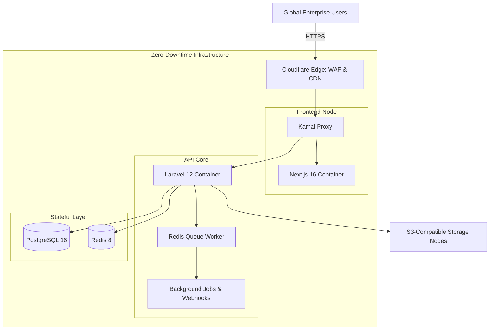

# R2Upload SaaS Infrastructure Architecture

**Lead Architect:** [Md. Kamruzzaman](https://www.linkedin.com/in/4kamruzzaman/)  
**Engineering Lab:** [BizSafer](https://bizsafer.com)  
**Live Production:** [https://r2upload.io](https://r2upload.io)  
**Enterprise Inquiries:** kamruzzaman@bizsafer.com

## System Overview
R2Upload is a secure enterprise file management and cloud storage platform. This repository details the high-availability infrastructure and deployment architecture designed to support heavy enterprise payloads across global Tier-1 markets.

The environment is strictly Production-First. It bridges a high-performance decoupled application core with industrial-grade reliability. 

## Infrastructure Topology

## Locked SRE Metrics
* **Uptime Target:** >99.9% via a zero single point of failure container-native architecture.
* **Global Latency:** Sub-200ms latency enforced by edge computing and optimized database indexing.
* **MTTR:** <60s via automated self-healing rollouts and strict continuous delivery pipelines.

## The Architecture Stack
The system operates on a fully decoupled micro-architecture.

* **Edge Delivery & Security:** Cloudflare CDN, WAF, and global DNS routing.
* **Frontend Edge Node:** Next.js 16 deployed as a standalone Docker container.
* **API Core:** Laravel 12 API handling rate limiting, Stripe billing, and asynchronous webhook dispatching.
* **Stateful Persistence:** PostgreSQL 16 for relational data and multi-tenant resource quotas.
* **High-Concurrency Queue:** Redis 8 managing background job processing and caching layers.
* **External Storage:** S3-Compatible Storage nodes strictly isolated for enterprise payload persistence.

## Deployment & Orchestration
The deployment pipeline is fully automated to guarantee zero-downtime rollouts.

* **Containerization:** 100% Dockerized environments isolating the Next.js frontend, Laravel API, PostgreSQL, and Redis instances.
* **Continuous Integration:** GitHub Actions pipelines handle automated testing, static analysis via PHPStan, and pushing immutable images to GitHub Container Registry.
* **Continuous Delivery:** Kamal 2 orchestration utilizing kamal-proxy to execute atomic traffic swapping, manage zero-downtime rolling updates, and instantly roll back unhealthy deployments.

## Security Posture
* Multi-layer defense-in-depth utilizing Cloudflare WAF to block malicious payloads at the edge.
* Hardened Nginx reverse proxies within the API containers.
* Strict API key validation and rate-limiting middleware segmented by subscription tiers.
